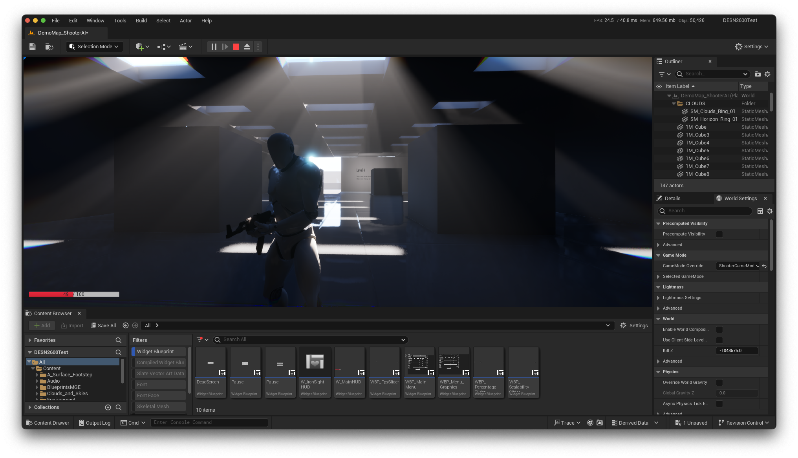

# 3rd Person Shooter (still thinking of a name)
### Current engine version: `Unreal Engine 5.4.4`

> [!NOTE]  
> This project uses both blueprints and C++

## Maintenance: 

## Release Pipeline: 

## Features
### HUD
- Performance overlay
- Health Bar
- Mag / Ammo Count
- Crosshair
- Score tracker
- Session timer

### Menus
- Main Menu
- Graphics settings menu
- Pause menu
- Win/Lose screen

### Player & Camera
- Standard Third person camera
- Shoulder switching
- Third person aiming
- Standard third person movement
- Sprinting & Crouching

### Gameplay
- Raycast based shooting
- Reloading system
- Standard Win/Lose condition
- Dynamic & Fixed location based spawn triggers

## Graphics
- AMD FSR 3.1.1 upscaling
- UE5 TSR & TAAU
- Lumen GI & Reflections
- SSGI & SSR fallbacks
- Virtual Shadow Maps
- Cascaded Shadow Map fallbacks
- DX12 & Metal 3 support
- DX11 & Metal 2 fallback (coming soon)
- Shader Model 6 support
- Shader Model 5 fallback (coming soon)

## AI
- Basic Enemy AI with different shooter types.
- Enemy AI based on perception system.
- Health & Damage system.
- Mesh location based damage system.
- Audio & visual perception.

# Recommened Specs
| Specification     | Minimum                          | Recommended                     |
|-------------------|----------------------------------|---------------------------------|
| CPU               | i7-3770K or Ryzen 3200G          | i7-8750H or Ryzen 5 4600H       |
| RAM               | 8GB                              | 16GB or higher                  |
| Storage           | Nvme SSD 5GB of free space       | Nvme SSD 5GB of free space      |
| GPU               | Nvidia MX550 2GB or RX 560 4GB   | GTX 1060 3GB or RX 470 4GB      |
| Shader Model      | 5.0+                             | 6+ for VSM, Lumen etc           |
| API               | DX11 or Vulkan                   | DX12 or Vulkan                  |
| OS                | Windows 10 or macOS 10.12        | Windows 11 or macOS 10.15       |
| Engin Version     | 5.4.4                            | 5.4.4                           |

> [!NOTE]  
> See this [link](https://dev.epicgames.com/documentation/en-us/unreal-engine/hardware-and-software-specifications-for-unreal-engine#:~:text=to%2016%20cores.-,Requirements%20for%20UE5%20Rendering%20Features,-Some%20rendering%20features)
for more info on requirements for UE5 Rendering Features on Windows.

# Recommened Specs Apple Silicon
| Specification     | Minimum                          | Recommended                     |
|-------------------|----------------------------------|---------------------------------|
| CPU               | Apple M2 8 Core CPU (4E/4P)      | Apple M1 Pro 8 Core CPU (6P/2E) |
| RAM               | 8GB                              | 16GB or higher                  |
| Storage           | Nvme SSD 5GB of free space       | Nvme SSD 5GB of free space      |
| GPU               | Apple M2 8 Core GPU              | Apple M1 Pro 14 Core GPU        |
| API               | Metal 2.4                        | Metal 3                         |
| OS                | macOS 13.0                       | macOS 14                        |
| Xcode             | 14.1                             | Any >= 14.1                     |
| Engin Version     | 5.4.4                            | 5.4.4                           |

> [!NOTE]
> See this [link](https://dev.epicgames.com/documentation/en-us/unreal-engine/hardware-and-software-specifications-for-unreal-engine#:~:text=to%2016%20cores.-,Requirements%20for%20UE5%20Rendering%20Features,-Some%20rendering%20features)
for more info on requirements for UE5 rendering features on macOS.

# Recommended Specs Intel Macs
| Specification     | Minimum                          | Recommended                     |
|-------------------|----------------------------------|---------------------------------|
| CPU               | i7-6700HQ                        | i7-8750H                        |
| RAM               | 8GB                              | 16GB or higher                  |
| Storage           | Nvme SSD 5GB of free space       | Nvme SSD 5GB of free space      |
| GPU               | Radeon Pro 560 4GB               | Radeon Pro 5500M 8GB            |
| Shader Model      | 5.0+                             | 6+ for VSM, Lumen etc           |
| API               | Metal 2                          | Metal 2                         |
| OS                | macOS 10.12                      | macOS 10.15                     |
| Xcode             | 14.1                             | Any >= 14.1                     |

> [!NOTE]  
>  Apple silicon Mac compatibility and performance was tested on:
>   - `2023 MacBook Pro 14" M2 Pro (10 core CPU/16 Core GPU/16GB RAM)`
>   - `2021 MacBookPro 16" M1 Max (10 core GPU/32 Core GPU/16GB RAM)`
>
> Intel Mac compatibility and performance was tested on: 
>   - `2016 MacBook Pro 15" (i7-6700HQ + Radeon Pro 455/16GB RAM)`
>   - `2018 MacBook Pro 15" (i7-8850H + Radeon Pro 560X/16GB RAM)`

> [!WARNING]
> Nanite & Virtual Shadow Maps (VSM) is only available for Apple Silicon M2+  
> FSR 1 and FSR 2 are now Deprecated. FSR 3 is now available for the latest builds.  
> FSR 3 requires a Polaris (RX 5XX) GPU or newer for AMD and Pascal (GTX 10XX) GPU or newer for Nvidia.  
> FSR 3 implementation in this project is consist of the upscaling component, no frame generation.  
> Currently FSR 3 is only available for Windows builds, macOS would still have TSR.

> [!TIP]
> Options for FSR 3 are available in the graphics settings for windows builds.

# FSR commands. For (v1.0) build.
- For mac users: replace `r.FidelityFX.FSR2` with `r.FidelityFX.FSR1`

| Commands                                | Actions                          |
|-----------------------------------------|----------------------------------|
| `r.FidelityFX.FSR2.Enabled 0`           | Turn FSR 2 `Off`                 |
| `r.FidelityFX.FSR2.Enabled 1`           | Turn FSR 2 `On`                  |
| `r.FidelityFX.FSR2.RCAS.Enabled`        | Contrast adaptive sharpening     |
| `r.FidelityFX.FSR2.QualityMode 1`       | FSR 2 Quality Mode               |
| `r.FidelityFX.FSR2.QualityMode 2`       | FSR 2 Balanced Mode              |
| `r.FidelityFX.FSR2.QualityMode 3`       | FSR 2 Performance Mode           |
| `r.FidelityFX.FSR2.QualityMode 4`       | FSR 2 Ultra Performance Mode     |
| `r.FidelityFX.FSR2.EnableFP16OnNvDX11 1`| Enable half precision mode on Nvidia|

# FSR 3.1.1 commands.

| Commands                                | Actions                          |
|-----------------------------------------|----------------------------------|
| `r.FidelityFX.FSR3.EnableFP16OnNvDX11 1`| Enable half precision mode on Nvidia|

# Optimization
- `Resolution Scale`: `100%` if TSR or FSR is off.
- `View Distance`: `Near`, the map is small.
- `Anti-Aliasing Mode`: `TAA` or `TSR` if render resolution is below 100%.
- `Anti-Aliasing`: `Epic` if TAA is enabled, High if TSR is enabled.
- `Post Processing`: `High`, Enables lens effects. This can be controlled individually.
- `Shadows`: `High-Epic` Allows soft shadows & volumetric shadows. Medium if your GPU doesn't support SM6.
- `Global Illumination`: `High` for Lumen, going lower will default to SSGI and SSAO.
- `Reflections`: `High` for Lumen, going lower will default to SSR.
- `Textures`: Low = 1.5 GB, Medium = 2-3 GB, High = 4 GB, Epic = 4-6 GB, Cinematic = 6-8 GB
- `Effects`: `Epic`, going lower will disable volumetric lighting.
- `Foliage`: `Cinematic`, There's no foliage in the scene.
- `Shading`: `Epic`, no performance cost until Cinematic.
- `Landscape`: `Epic`, no performance cost until Cinematic.

> [!TIP]
> You can use the performance overlay to see the performance impact of each setting in real-time.
>   To do so go to `Options > Graphics > Performance Overlay`.

### Downloads 
  After downloading, extract the zip file and run the executable (Might need to run as admin).
  If you're on macOS, you might need to allow the app to run in `System Preferences > Security & Privacy` On Windows, you might need to allow the app to run when prompted by Windows Security.
- <b>v1.0 (Deprecated) Windows_x86_64:</b> <a href="https://www.dropbox.com/sh/iaq1bsasgaz5znd/AABZkdeA_N6LC4kTpRVe0Af3a?dl=1">Download here</a>
- <b>v2.2.2 Windows_x86_64:</b> <a href="https://www.dropbox.com/scl/fi/ge4axmbig7k51lupxdmoo/TPS-2.2.2-win_x86_64.zip?rlkey=1xt73js4cpto6v2hasndm6319&st=13n8o83c&dl=0">Download here</a>
- <b>v2.2.2 macOS (Intel & Apple Silicon):</b> <a href="https://www.dropbox.com/scl/fi/cfedh1oo6f2l02rzw66dc/TPS-2.2.2-macOS.zip?rlkey=4aj4zfqzk5q5fzg0l4l48br75&st=wt7a457k&dl=0">Download here</a>

> [!NOTE]  
> FSR 2 is only available on Windows v1.0 build.  
> TPS `v2.0 +` is built with `Unreal Engine 5.4.4` with native Apple Silicon support.  
> Currently `v2.0 +` uses DX12 for Windows & Metal 3 for macOS.

### Upcoming features

- [X] ~~- Update DLSS to DLSS 2.3 or DLSS 3.~~
- [X] Add FSR 1 for Mac.
- [X] Add graphics options for ~~- DLSS~~ and FSR.
- [X] Add a perforamnce overlay.
- [X] Add graphics option for TSR and Anti-Aliasing.
- [X] Update base engine to 5.2.0 for native apple silicon support.
- [X] Update base engine to 5.3.0 for navite apple silicon supoort for lumen and nanite.
- [X] Add support for FSR 3 for Unreal Engine 5.4.4.
- [X] Reloading System.
- [X] Shoulder Switching System.
- [X] Objectives System & Win Condition.

### Screenshots
 

 

 

 
