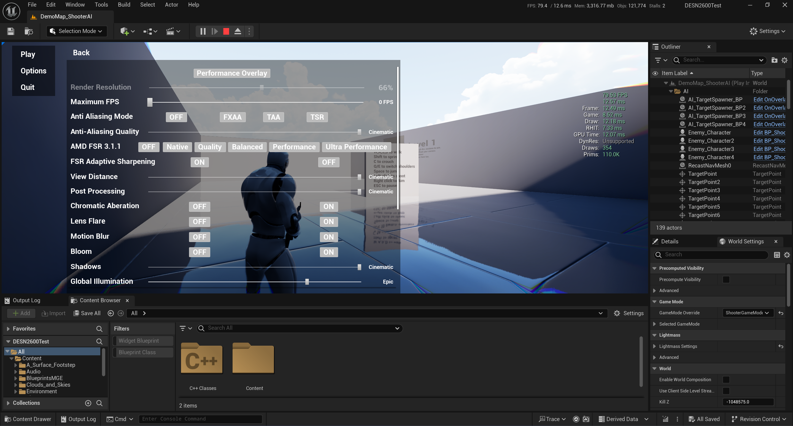

# 3rd Person Shooter (still thinking of a name)
# Maintenance: 
# Recommened Specs
| Specification     | Minimum                          | Recommended                     |
|-------------------|----------------------------------|---------------------------------|
| CPU               | i7-3770K or Ryzen 3200G          | i7-8750H or Ryzen 5 4600H       |
| RAM               | 8GB                              | 16GB or higher                  |
| Storage           | Nvme SSD5GB of free space        | Nvme SSD5GB of free space       |
| GPU               | Intel Iris Xe 96EU               | GTX 1050 or RX 550              |
| OS                | Windows 10 or macOS 10.12        | Windows 10 or macOS 10.15       |

‼️ Apple silicon isn't supported `M1` & `M2` SKUs  
‼️ DLSS only supprts `RTX 20 Series` and newer.  
### Available in both `C++` and `Blueprints`
### Made with `Unreal Engine 4.27`, compatible with `Unreal Engine 5.0+`
### Featuring `AMD FSR 2.1`, `Bots` and `Guns!` <a href="https://www.dropbox.com/sh/iaq1bsasgaz5znd/AABZkdeA_N6LC4kTpRVe0Af3a?dl=1">Download</a>
 

 

 

