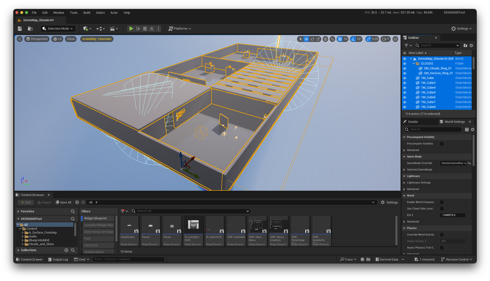
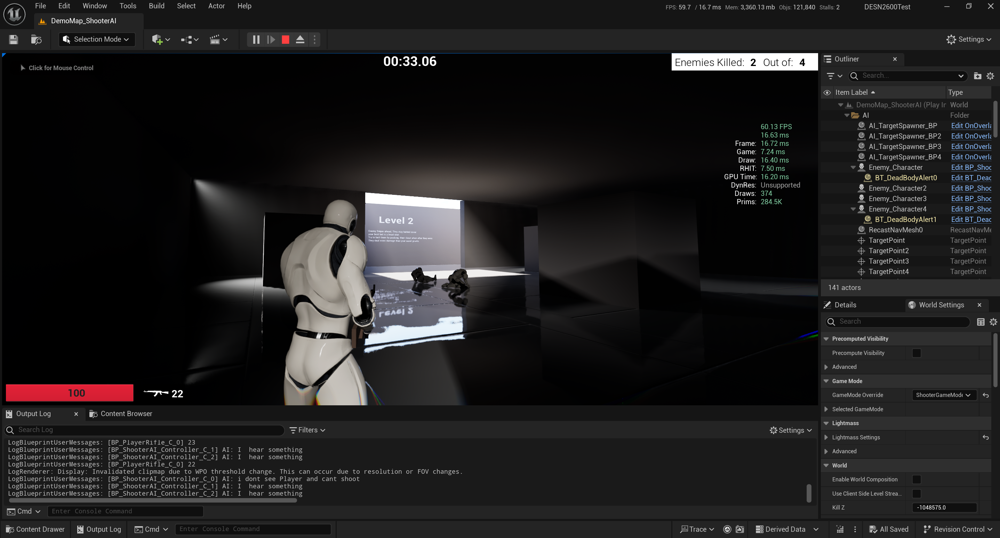

# 3rd Person Shooter (still thinking of a name)
### Started development with `Unreal Engine 4.27`, now developing with `Unreal Engine 5`

## Maintenance: 

## Release Pipeline: 

# Recommened Specs
| Specification     | Minimum                          | Recommended                     |
|-------------------|----------------------------------|---------------------------------|
| CPU               | i7-3770K or Ryzen 3200G          | i7-8750H or Ryzen 5 4600H       |
| RAM               | 8GB                              | 16GB or higher                  |
| Storage           | Nvme SSD 5GB of free space       | Nvme SSD 5GB of free space      |
| GPU               | Nvidia MX550 2GB                 | GTX 1060 3GB or RX 470 4GB      |
| Shader Model      | 5.0+                             | 6+ for VSM, Lumen etc           |
| API               | DX11 or Vulkan                   | DX12 or Vulkan                  |
| OS                | Windows 10 or macOS 10.12        | Windows 11 or macOS 10.15       |

# Recommened Specs Apple Silicon
| Specification     | Minimum                          | Recommended                     |
|-------------------|----------------------------------|---------------------------------|
| CPU               | Apple M2 8 Core CPU (4E/4P)      | Apple M1 Pro 8 Core CPU (6P/2E) |
| RAM               | 8GB                              | 16GB or higher                  |
| Storage           | Nvme SSD 5GB of free space       | Nvme SSD 5GB of free space      |
| GPU               | Apple M2 8 Core GPU              | Apple M1 Pro 14 Core GPU        |
| API               | Metal 2.4                        | Metal 3                         |
| OS                | macOS 13.0                       | macOS 14                        |

# Recommended Specs Intel Macs
| Specification     | Minimum                          | Recommended                     |
|-------------------|----------------------------------|---------------------------------|
| CPU               | i7-6700HQ                        | i7-8750H                        |
| RAM               | 8GB                              | 16GB or higher                  |
| Storage           | Nvme SSD 5GB of free space       | Nvme SSD 5GB of free space      |
| GPU               | Radeon Pro 560 4GB               | Radeon Pro 5500M 8GB            |
| Shader Model      | 5.0+                             | 6+ for VSM, Lumen etc           |
| API               | Metal 2                          | Metal 2                         |
| OS                | macOS 10.12                      | macOS 10.15                     |

> [!NOTE]  
> - ~~‼️ Apple silicon is now supported with `macOS 13.0+` and `Unreal Engine 5.1.1+`~~
> - Apple silicon is now supported with `macOS 13.0+` and `Unreal Engine 5.2+`
> - Apple silicon Mac compatibility and performance was tested on:
> - `2023 MacBook Pro 14" M2 Pro (10 core CPU/16 Core GPU)`
> - `2021 MacBookPro 16" M1 Max (10 core GPU/32 Core GPU)`
> - Intel Mac compatibility and performance was tested on: 
> - `2016 MacBook Pro 15" (i7-6700HQ + Radeon Pro 455)`
> - `2018 MacBook Pro 15" (i7-8850H + Radeon Pro 560X)`
> - Use `r.FidelityFX.FSR2.EnableFP16OnNvDX11` to enable half precision mode if GPU < `Maxwell` / `GCN 1.0

> [!WARNING]  
> Known issues:
> - ~~Apple silicon isn't supported `M1` & `M2` SKUs~~
> - `UE 5.2.1` will not launch because of `FSR 2.2.1`.
> - For now macOS platforms can only use `FSR 1.0` & `FSR Mobile`.
> - For now `FSR 2` Doesn't work on macOS 13+ use `r.FidelityFX.FSR2.Enabled 0` to disable.
> - The latest builds only offer Unreal Engine's Temporal Super Resolution (TSR) in regards to upscaling.

# FSR commands
- For mac users: replace `r.FidelityFX.FSR2` with `r.FidelityFX.FSR1`

| Commands                                | Actions                          |
|-----------------------------------------|----------------------------------|
| `r.FidelityFX.FSR2.Enabled 0`           | Turn FSR 2 `Off`                 |
| `r.FidelityFX.FSR2.Enabled 1`           | Turn FSR 2 `On`                  |
| `r.FidelityFX.FSR2.RCAS.Enabled`        | Contrast adaptive sharpening     |
| `r.FidelityFX.FSR2.QualityMode 1`       | FSR 2 Quality Mode               |
| `r.FidelityFX.FSR2.QualityMode 2`       | FSR 2 Balanced Mode              |
| `r.FidelityFX.FSR2.QualityMode 3`       | FSR 2 Performance Mode           |
| `r.FidelityFX.FSR2.QualityMode 4`       | FSR 2 Ultra Performance Mode     |

# Optimization
#### These Settings were tested on an MX550 resulting in 51fps min and 58fps max @1080p
- `Resolution Scale`: `100%` if TSR or FSR is off.
- `View Distance`: `Near`, the map is small.
- `Anti-Aliasing Mode`: `TAA` or `TSR` if render resolution is below 100%.
- `Anti-Aliasing`: `Epic` if TAA is enabled, High if TSR is enabled.
- `Post Processing`: `High`, Enables lens effects.
- `Shadows`: `High-Epic` Allows soft shadows & volumetric shadows.
- `Global Illumination`: `High` for Lumen, going lower will default to SSGI and SSAO.
- `Reflections`: `High` for Lumen, going lower will default to SSR.
- `Textures`: Low = 1.5 GB, Medium = 2-3 GB, High = 4 GB, Epic = 4-6 GB, Cinematic = 6-8 GB
- `Effects`: `Epic`, going lower will disable real-time dynamic directional light source. No light baking is implemented yet so the scene will become dark.
- `Foliage`: `Cinematic`, There's no foliage in the scene.
- `Shading`: `Epic`, no performance cost until Cinematic.
- `Landscape`: `Epic`, no performance cost until Cinematic.

> [!TIP]
>   You can use the performance overlay to see the performance impact of each setting in real-time.
>   To do so go to `Options > Graphics > Performance Overlay`.

> [!CAUTION]
>   Setting render resolution lower than 30% may cause visual artifacts.
>   Setting Global Illumination to medium will disable Lumen GI and Lumen Reflections.
>   Setting Effects to High or lower will make the scene become dark.

### Downloads 

- <b>v1.0 Windows_x86_64:</b> <a href="https://www.dropbox.com/sh/iaq1bsasgaz5znd/AABZkdeA_N6LC4kTpRVe0Af3a?dl=1">Download here</a>
- <b>v2.1 Windows_x86_64:</b> <a href="https://www.dropbox.com/scl/fo/sv01yicixj3jxhf2iqp9r/AF35lhdCMbRm5VVAfNO4n8M?rlkey=zt1ijovaqo47ev99y9fi2qrtt&st=vthjub3p&dl=0">Download here</a>
- <b>v2.1 macOS (Intel & Apple Silicon):</b> <a href="https://www.dropbox.com/scl/fi/avt0ow3sq7wr7e9a3gplq/TPS-v2.1-macos-universal.zip?rlkey=3i313epwnz31b6y0o97phvo3r&st=6as49pwj&dl=0">Download here</a>

  After downloading, extract the zip file and run the executable.
  If you're on macOS, you might need to allow the app to run in `System Preferences > Security & Privacy` On Windows, you might need to allow the app to run in `Windows Security` prompt.

### Download notes
- `FSR 2` is only available on Windows v1.0.
- `v1.0` is built with `Unreal Engine 5.0.3`.
- `v2.0` is built with `Unreal Engine 5.4.4` with native Apple Silicon support.
- `v1.0` on Windows uses DX11, `v2.0` uses DX12 & Metal 3 for macOS.

### Upcoming features

- [X] ~~- Update DLSS to DLSS 2.3 or DLSS 3.~~
- [X] Add FSR 1 for Mac.
- [ ] Add graphics options for ~~- DLSS~~ and FSR.
- [X] Add a perforamnce overlay.
- [X] Add graphics option for TSR and Anti-Aliasing.
- [X] Update base engine to 5.2.0 for native apple silicon support.
- [X] Update base engine to 5.3.0 for navite apple silicon supoort for lumen and nanite.

### Screenshots
 

 

 

 
